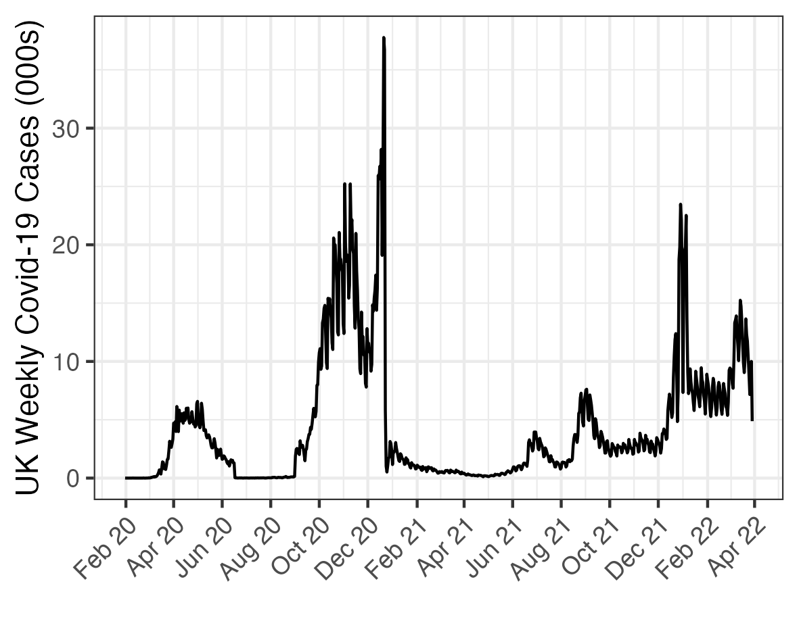
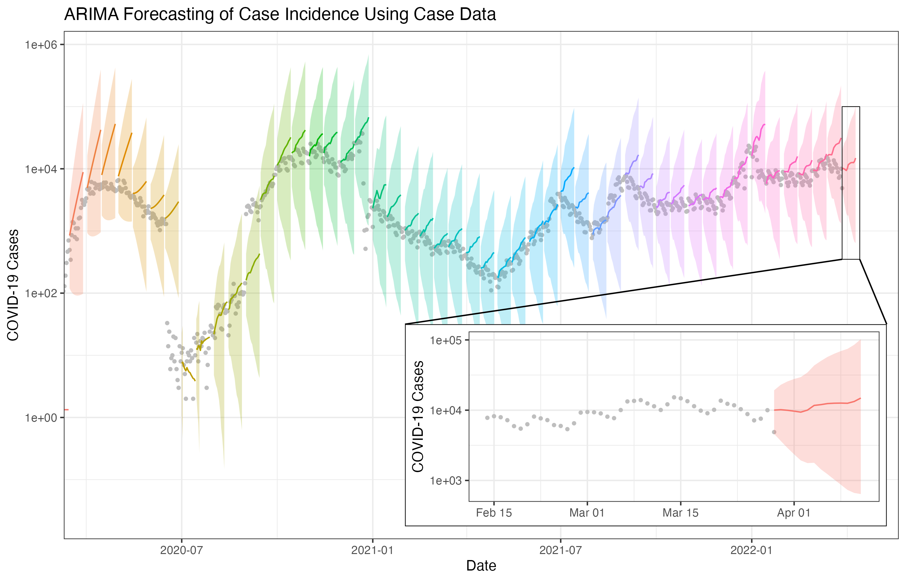

# InfecTech
For the next pandemic

Slides are here: https://docs.google.com/presentation/d/1Vrt-Dy5cherOvEgm_qoKv_k9fVKMPKyANIPI6jVlueI/edit?usp=sharing

## Sourcing Target Data

Target data will depend on the question being asked by policy-makers. Researchers will source this data either privately or from API databases (e.g. Global.Health) 

We include an example where target data is the number of Covid cases in the UK which has been transformed from the linelist hosted on Global.Health into a time series

The data can be reconstructed by running:
```
source("src/data_covid_cases/script.R")
```

Or alternatively the processed time series data are located here: [src/data_covid_cases/outputs/cases_GB.csv]



## Sourcing Predictor Data

Researchers may wish to include additional data sets as predictors in their models, which may come from traditional sources (such as demographic or epidemiological data) or non-traditional sources (such as social media data). 

We include an example here of how a twitter data set can be used as a predictor using topic modelling. Topic modelling is a method in which documents can be represented in terms of their relationship to abstract "topics". The full text cleaning and topic modelling process is documented in 

The resulting data set, tweets with topic scores is 

## Forecast Modelling

Researchers will use their models (and potentially predictor data) to produce forecasts of the target data over time. We include an example here of a simple ARIMA forecast, as well as ARIMA using covariate data from the longitudnal topic trends derived from twitter.



## Model Evaluation and Ensembling

Substantial mathematical and statistical frameworks were developed during the pandemic to evaluate model forecasts, however, outputs not always easy to interpret by policymakers, nor suited to their purposes - for example evaluating performance based on mean absolute error, rather than statistics policy-makers may care more about such as minimising downside risk.

We include an example of a standard forecast evaluation output along with our human-interpretable, policy focussed version, and show how our foundational principle of improving the interpretability and usefulness of model performance analytics to policy-makers can be carried forward from individual model assessment to the creation of ensemble models:

[src/human_interpretable/script.html]

## Deep Learning based Forecasts

We experimented with Sequence to Sequence, deep learning alternatives to the
ARIMA forecast. An in-depth description of those experiments are listed in that

